<div align="center">

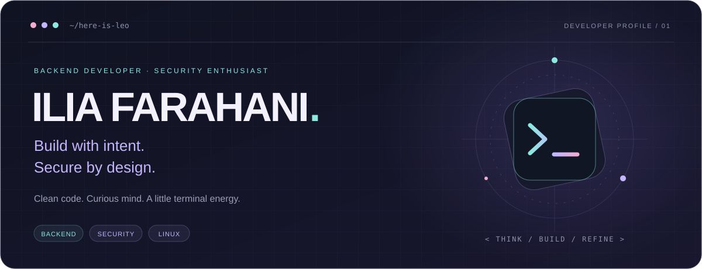

<br /><br />

<a href="https://here-is-leo.ir/"></a>
<a href="https://www.linkedin.com/in/ilya-farahani"></a>
<a href="https://t.me/Here_is_leo"></a>
<a href="mailto:ilyafarahanii@gmail.com"></a>

<br /><br />

**I care about what happens beneath the surface.**

The API that stays predictable. The authentication flow that holds up.<br />
The deployment you can repeat. The code someone else can understand.

<sub>BACKEND DEVELOPMENT &nbsp; / &nbsp; APPLICATION SECURITY &nbsp; / &nbsp; LINUX & AUTOMATION</sub>

</div>

<br />


I’m **Ilia Farahani**, a backend developer with a security-focused mindset.<br />
I like understanding how things work — and what happens when their assumptions break.

```python
ilia = {
    "alias": "here-is-leo",
    "home": "Linux / terminal / editor",
    "focus": ["Backend systems", "Application security"],
    "approach": "Understand → Build → Test → Refine",
}
```

<p align="center">
</p>
<p align="center">
</p>

<br />


| Layer | Technologies |
| :--- | :--- |
| **Backend** | Python · C# · .NET · Node.js · Express · Django · Flask |
| **Frontend** | JavaScript · React · Next.js · HTML · CSS · Tailwind CSS |
| **Infrastructure** | Linux · Kali Linux · Bash · Docker · Nginx · GitHub Actions |
| **Data** | SQLite · Microsoft SQL Server |
| **Workflow** | Git · GitHub · VS Code · Visual Studio · Postman |

<br />


**↗ Scalable APIs**<br />
Services that stay understandable as they grow.

**↗ Application security**<br />
Understanding attack paths to build better defenses.

**↗ System design**<br />
Turning requirements into deliberate architectural decisions.

**↗ Automation & CI/CD**<br />
Making delivery repeatable, one workflow at a time.

<br />

<details>
<summary><b>⌘ &nbsp; Open the developer terminal</b></summary>

```console
ilia@linux:~$ cat mindset.txt

Read the source.
Question the assumptions.
Make the complex understandable.
Leave the system better than you found it.

ilia@linux:~$ ./next-idea
> Learn. Build. Improve. Repeat.
```

</details>

<br />

<details>
<summary><b>↗ &nbsp; Explore repositories & contribution activity</b></summary>

<br />

[Browse my repositories →](https://github.com/here-is-leo?tab=repositories)


</details>

<br /><br />

<a href="mailto:ilyafarahanii@gmail.com"></a>

<p align="center"><sub>ILIA FARAHANI &nbsp; / &nbsp; here-is-leo &nbsp; / &nbsp; STAY CURIOUS.</sub></p>
